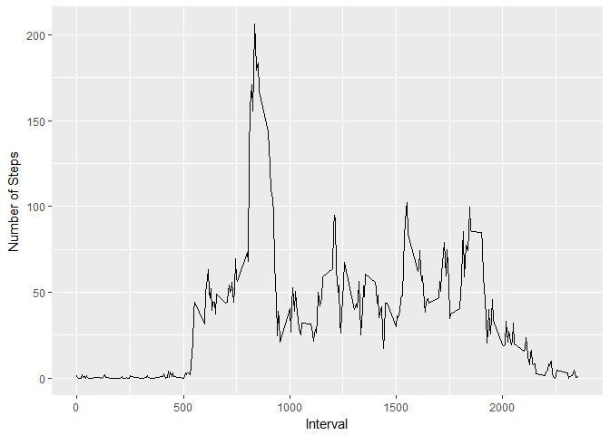

# Reproducible Research: Peer Assessment 1


## Loading and preprocessing the data

```r
        library(readr)
        activity <- read_csv("activity.csv")
```

```
## Parsed with column specification:
## cols(
##   steps = col_integer(),
##   date = col_date(format = ""),
##   interval = col_integer()
## )
```


## What is mean total number of steps taken per day?
* First, we make a histogram of the total number of steps taken each day:


```r
        library(ggplot2)
        steps_per_day <- aggregate(activity$steps, list(activity$date), sum)
        qplot(activity$steps, geom="histogram") 
```

```
## `stat_bin()` using `bins = 30`. Pick better value with `binwidth`.
```

```
## Warning: Removed 2304 rows containing non-finite values (stat_bin).
```

<!-- -->

* Second, we calculate and report the mean and median total number of steps taken per day:


```r
       mean_steps <- mean(steps_per_day$x, na.rm = TRUE)
       median_steps <- median(steps_per_day$x, na.rm = TRUE)
```

Mean number of steps per day is 10766.1886792453, while median number of steps per day is 10765

## What is the average daily activity pattern?

* Make a time series plot (i.e. type = "l") of the 5-minute interval (x-axis) and the average number of steps taken, averaged across all days (y-axis)


```r
library(scales)
```

```
## 
## Attaching package: 'scales'
```

```
## The following object is masked from 'package:readr':
## 
##     col_factor
```

```r
steps_per_interval <- aggregate(activity$steps, list(activity$interval), function(x) {mean(x, na.rm = TRUE)})
ggplot(steps_per_interval, aes(Group.1, x)) + geom_line()+ xlab("Interval") + ylab("Number of Steps")
```

<!-- -->

* Which 5-minute interval, on average across all the days in the dataset, contains the maximum number of steps?


```r
max_steps <- max(steps_per_interval$x)
max_interval <- steps_per_interval[steps_per_interval$x == max_steps,]$Group.1
```
We can see that interval 835 contains the maximum number of steps (206.1698113).

## Imputing missing values

* Calculate and report the total number of missing values in the dataset (i.e. the total number of rows with NAs)


```r
num_na <- nrow(activity[is.na(activity$steps) == TRUE,])
```
        Answer: total number of missing values in the dataset is 2304.

* Devise a strategy for filling in all of the missing values in the dataset. The strategy does not need to be sophisticated. For example, you could use the mean/median for that day, **or the mean for that 5-minute interval**, etc.

        Answer: We will use strategy highlighted in bold. I.e., for every missing
value, we will use mean for that 5-minute interval


* Create a new dataset that is equal to the original dataset but with the missing data filled in.

* Make a histogram of the total number of steps taken each day and Calculate and report the mean and median total number of steps taken per day. Do these values differ from the estimates from the first part of the assignment? What is the impact of imputing missing data on the estimates of the total daily number of steps?


## Are there differences in activity patterns between weekdays and weekends?

* Create a new factor variable in the dataset with two levels -- "weekday" and "weekend" indicating whether a given date is a weekday or weekend day.

* Make a panel plot containing a time series plot (i.e. type = "l") of the 5-minute interval (x-axis) and the average number of steps taken, averaged across all weekday days or weekend days (y-axis). The plot should look something like the following, which was created using simulated data:
