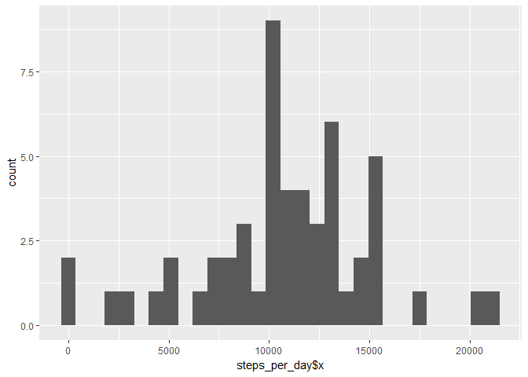

# Reproducible Research: Peer Assessment 1


## Loading and preprocessing the data

```r
        library(readr)
        activity <- read_csv("~/RepData_PeerAssessment1/activity.csv")
```

```
## Parsed with column specification:
## cols(
##   steps = col_integer(),
##   date = col_date(format = ""),
##   interval = col_integer()
## )
```


## What is mean total number of steps taken per day?
* First, make a histogram of the total number of steps taken each day:


```r
        library(ggplot2)
        steps_per_day <- aggregate(activity$steps, list(activity$date), sum)
        qplot(activity$steps, geom="histogram") 
```

```
## `stat_bin()` using `bins = 30`. Pick better value with `binwidth`.
```

```
## Warning: Removed 2304 rows containing non-finite values (stat_bin).
```

<!-- -->

* Second, calculate and report the mean and median total number of steps taken per day:


```r
       mean_steps <- mean(steps_per_day$x, na.rm = TRUE)
```

```r
       median_steps <- median(steps_per_day$x, na.rm = TRUE)
```
Mean number of steps per day is 1.0766189\times 10^{4}, while median number of steps per day is 10765

## What is the average daily activity pattern?


```r
steps_per_interval <- aggregate(activity$steps, list(activity$interval), function(x) {mean(x, na.rm = TRUE)})
ggplot(steps_per_interval, aes(strptime(Group.1, format="%H%M"), x)) + geom_line()+ xlab("Time") + ylab("Number of Steps")
```

```
## Warning: Removed 99 rows containing missing values (geom_path).
```

<!-- -->


```r
max_steps <- max(steps_per_interval$x)
max_interval <- steps_per_interval[steps_per_interval$x == max_steps,]$Group.1
max_interval <- strptime(max_interval, format="%H%M")
```


## Imputing missing values


## Are there differences in activity patterns between weekdays and weekends?
